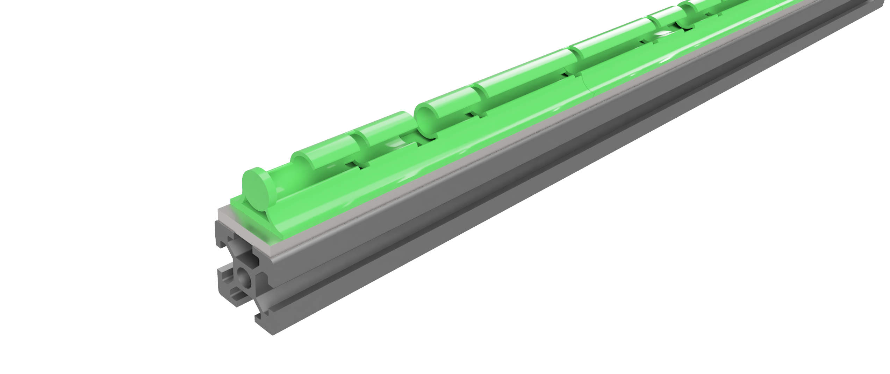
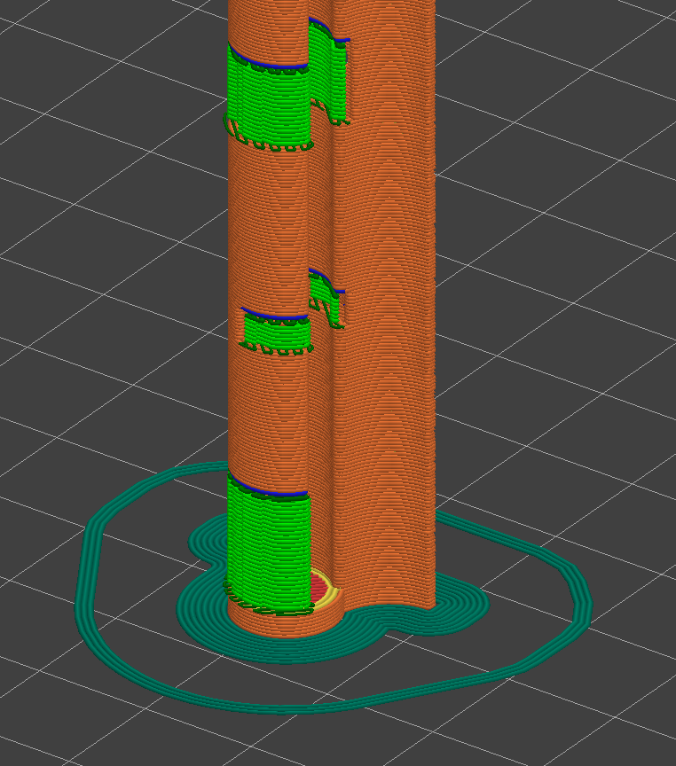

# Cable Channel 

**Note ⚠️:** The channel is designed for a 300mm v2.4/Trident. For other sizes, modifications to the channel will be necessary.

This is a cable channel for routing the front motor wires to the back of the gantry. While this channel is specifically designed for use with titanium backers, it can be used without them.

## BOM
- 6x M3x10 SHCS
- 6x M3 T-nut
- 16x 2mm ziptie 

## Printing
Print the parts on the sides, and use snug supports. For better bed adhesion, I recommend using a brim.  

